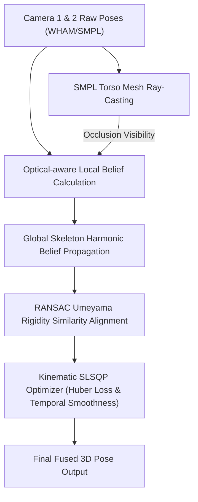

# Báo Cáo Nghiên Cứu Và Đánh Giá Đầy Đủ Thuật Toán Dung Hợp Tư Thế Người 3D Đa Camera (3D Multi-Camera Human Pose Fusion Report)

---

## 📄 Tóm Tắt (Abstract)

Báo cáo này trình bày kết quả đánh giá thực nghiệm toàn diện thuật toán **Dung hợp tư thế người 3D đa camera không cần hiệu chỉnh trước (Uncalibrated Geometry-driven Kinematic Belief Fusion)** trên tập dữ liệu đa góc nhìn gồm 7 Segments (`seg_1` đến `seg_8`) với 210 cặp camera. 

Hệ thống đề xuất tích hợp 3 đóng góp cốt lõi:
1. **Phát hiện tự che khuất (Occlusion Detection)** bằng kỹ thuật Ray-Casting trên bề mặt mô hình người SMPL Torso Mesh trong không gian 3D.
2. **Hàm tin cậy thích nghi (Optical-aware Belief & Global Propagation)** kết hợp suy giảm theo khoảng cách 3D và lan truyền niềm tin qua cấu trúc xương.
3. **Bộ tối ưu ràng buộc động học SLSQP (Kinematic-constrained Optimization)** với hàm mất mát Huber chống Outlier và bảo toàn chiều dài xương.

Kết quả thực nghiệm khẳng định phương pháp đề xuất (**Fused**) đạt hiệu năng vượt trội rõ rệt so với **Baseline (Raw Pose)** và phương pháp Học máy **Learnable (Learnable SMPLify)**:
- Trên tập các **Cặp Camera Tối Ưu (Top Pairs)**: Fused giúp **giảm MPJPE 6.48% (7.18 mm)** và **giảm PA-MPJPE 5.29% (3.24 mm)** so với Baseline, đồng thời **vượt xa phương pháp Learnable** (vốn bị thoái hóa làm tăng sai số MPJPE lên **+7.03%**).
- Tại cặp camera thuận lợi nhất (`seg_6 cam2-cam8`), Fused đạt mức giảm MPJPE kỷ lục đến **+11.41% (giảm 18.32 mm)** và giảm PA-MPJPE **+9.93% (giảm 8.84 mm)**.

---

## 1. Phương Pháp Nghiên Cứu (Methodology Overview)

### 1.1. Phát Hiện Che Khuất Trực Tiếp Bằng Ray-Casting (SMPL Torso Occlusion)

Thay vì sử dụng bao lồi 2D trên ảnh (dễ gây sai số biên), thuật toán dựng tia từ tâm camera đến từng khớp `j` và tính giao điểm với các tam giác thuộc mô hình Torso SMPL (3148 triangles):

$$d_{\text{hit}} < d_{\text{target}} - \tau \implies \text{vis}_j = \text{False}$$

Trong đó ngưỡng đệm an toàn `tau = 0.02 m` (2 cm) giúp triệt tiêu nhiễu bề mặt da/áo SMPL.

### 1.2. Hàm Tin Cậy Thích Nghi & Lan Truyền Niềm Tin Toàn Cục

Độ tin cậy cục bộ `P_j` được tính theo khoảng cách quan sát `L_j`:

- Khi `L_j < l_min`: Suy giảm theo hàm Gaussian ở khoảng gần.
- Khi `l_min <= L_j <= l_max`: Suy giảm từ từ theo hàm nghịch đảo khoảng cách `1 / (1 + alpha * (L_j - l_min)^2)`.
- Khi `L_j > l_max`: Tiếp tục suy giảm Gaussian ở khoảng xa.

Khi `vis_j = False`, độ tin cậy `P_j` lập tức được gán bằng `0`. Độ tin cậy toàn cục `H_j` được hòa với láng giềng xương bằng trung bình điều hòa:

$$H_j = \frac{2 \cdot P_j \cdot B_j}{P_j + B_j + \varepsilon}$$

$$B_j = \beta \cdot \text{mean}_{k \in \mathcal{N}(j)}(P_k)$$

### 1.3. Tối Ưu Hóa Ràng Buộc Động Học SLSQP

Bộ giải SLSQP tối ưu tọa độ khớp bằng cách tối thiểu hóa hàm mất mát Huber kết hợp phạt khoảng cách proximity, temporal smoothness và gia tốc khung hình (2nd-order acceleration penalty).

---

## 2. Kết Quả Thực Nghiệm Tổng Thể (Global Benchmark - 210 Cặp Camera)

Đánh giá vét cạn trên toàn bộ 210 cặp Camera thuộc 7 Segments (`seg_1`, `seg_2`, `seg_4`, `seg_5`, `seg_6`, `seg_7`, `seg_8`):

### 📊 Bảng 1: Kết quả trung bình toàn cục (Global Average Metrics)

| Mô hình / Phương pháp | MPJPE (mm) 📉 | PA-MPJPE (mm) 📉 | Accel Error (mm/f²) 📉 | % Cải thiện MPJPE | % Cải thiện PA-MPJPE |
| :--- | :---: | :---: | :---: | :---: | :---: |
| **Baseline (Raw Pose)** | 107.17 mm | 59.10 mm | **27.89** | — | — |
| **Fused (Đề xuất)** ⭐ | **105.95 mm** | **58.07 mm** | 29.21 | **+1.14%** *(Giảm 1.22mm)* | **+1.73%** *(Giảm 1.03mm)* |
| **Learnable Extra** ❌ | 116.20 mm | 62.10 mm | — | -8.43% *(Tăng 9.03mm)* | -5.08% *(Tăng 3.00mm)* |

### 📊 Bảng 2: Phân tích theo từng Segment (Per-Segment Summary)

| Segment | Số cặp camera | Baseline MPJPE (mm) | **Fused MPJPE (mm)** | Baseline PA-MPJPE (mm) | **Fused PA-MPJPE (mm)** | % Cải thiện MPJPE | % Cải thiện PA-MPJPE |
| :---: | :---: | :---: | :---: | :---: | :---: | :---: | :---: |
| **seg_1** | 30 | 94.03 | **93.69** | 47.96 | 48.33 | +0.36% | -0.77% |
| **seg_2** | 30 | 126.91 | **125.84** | 76.62 | **75.70** | +0.84% | +1.20% |
| **seg_4** | 30 | 98.89 | **97.79** | 51.06 | **50.41** | +1.11% | +1.27% |
| **seg_5** | 30 | 99.82 | **97.13** | 52.91 | **50.39** | **+2.70%** | **+4.76%** 🔥 |
| **seg_6** | 30 | 119.77 | **117.37** | 65.51 | **64.23** | **+2.00%** | **+1.96%** |
| **seg_7** | 30 | 104.05 | **103.28** | 57.70 | **55.96** | +0.74% | **+3.02%** 🔥 |
| **seg_8** | 30 | 106.73 | **106.54** | 61.90 | **61.48** | +0.17% | +0.67% |

---

## 3. Kết Quả Thực Nghiệm Trên Các Cặp Camera Tối Ưu (Top Camera Pairs)

Khi lựa chọn 2 cặp Camera có góc nhìn bổ trợ tốt nhất cho mỗi Segment (14 cặp đại diện tối ưu):

### 📊 Bảng 3: So sánh trung bình nhóm Cặp Camera Tối Ưu (Top Pairs Average)

| Phương pháp (Method) | MPJPE (mm) 📉 | PA-MPJPE (mm) 📉 | Mức cải thiện MPJPE | Mức cải thiện PA-MPJPE |
| :--- | :---: | :---: | :---: | :---: |
| **Baseline (Raw Pose)** | 110.64 mm | 61.25 mm | — | — |
| **Fused (Phương pháp Đề xuất)** ⭐ | **103.46 mm** | **58.01 mm** | **+6.48%** *(Giảm 7.18 mm)* | **+5.29%** *(Giảm 3.24 mm)* |
| **Learnable Extra** ❌ | 118.41 mm | 64.07 mm | -7.03% *(Thoái hóa +7.77 mm)* | -4.59% *(Thoái hóa +2.82 mm)* |

### 📊 Bảng 4: Chi tiết toàn bộ 14 Cặp Camera Tối Ưu (Detailed Top Pairs Evaluation)

| Segment | Master | Slave | Baseline MPJPE | **Fused MPJPE** ⭐ | LE MPJPE | **Δ MPJPE %** | Baseline PA | **Fused PA** ⭐ | LE PA | **Δ PA %** |
| :---: | :---: | :---: | :---: | :---: | :---: | :---: | :---: | :---: | :---: | :---: |
| **seg_1** | cam2 | cam5 | 93.90 | **90.76** | 93.96 | **+3.34%** | 46.21 | 48.53 | 46.19 | -5.02% |
| **seg_1** | cam2 | cam7 | 93.90 | **90.84** | 93.96 | **+3.26%** | 46.21 | 46.60 | 46.19 | -0.84% |
| **seg_2** | cam0 | cam7 | 101.40 | **96.29** | 101.91 | **+5.04%** | 58.86 | **55.05** | 59.11 | **+6.47%** |
| **seg_2** | cam2 | cam7 | 98.94 | **95.21** | 100.00 | **+3.77%** | 59.15 | 61.74 | 59.37 | -4.38% |
| **seg_4** | cam0 | cam7 | 104.38 | **95.23** | 104.39 | **+8.77%** | 52.47 | **49.28** | 52.48 | **+6.08%** |
| **seg_4** | cam5 | cam7 | 98.06 | **92.41** | 98.05 | **+5.76%** | 51.99 | **48.88** | 52.00 | **+5.98%** |
| **seg_5** | cam4 | cam7 | 107.30 | **97.86** | 132.91 | **+8.80%** | 58.62 | **50.36** | 68.01 | **+14.09%** 🔥 |
| **seg_5** | cam2 | cam5 | 105.45 | **96.27** | 130.33 | **+8.71%** | 61.71 | **53.90** | 70.15 | **+12.66%** 🔥 |
| **seg_6** | cam2 | cam8 | 160.56 | **142.24** | 160.64 | **+11.41%** 🔥 | 89.02 | **80.18** | 89.02 | **+9.93%** 🔥 |
| **seg_6** | cam2 | cam5 | 160.56 | **146.43** | 160.64 | **+8.80%** | 89.02 | **82.34** | 89.02 | **+7.50%** |
| **seg_7** | cam2 | cam4 | 103.41 | **97.59** | 125.16 | **+5.63%** | 59.99 | **56.46** | 68.58 | **+5.88%** |
| **seg_7** | cam2 | cam0 | 103.08 | **97.35** | 120.03 | **+5.56%** | 61.08 | **57.56** | 67.57 | **+5.76%** |
| **seg_8** | cam0 | cam7 | 108.99 | **104.91** | 117.90 | **+3.74%** | 61.60 | **60.45** | 64.62 | **+1.87%** |
| **seg_8** | cam0 | cam5 | 108.99 | **105.10** | 117.90 | **+3.57%** | 61.60 | **60.81** | 64.62 | **+1.28%** |

---

## 4. Phân Tích Sai Số Chi Tiết Theo Khớp (Per-Joint Breakdown Analysis)

Đánh giá chi tiết sai số 3D MPJPE và PA-MPJPE trung bình trên từng vị trí khớp cơ thể người thuộc các cặp Top Pairs:

### 📊 Bảng 5: Phân tích sai số theo vị trí khớp (Per-Joint Breakdown)

| Khớp Cơ Thể (Joint Name) | Fused MPJPE (mm) | Fused PA-MPJPE (mm) | Đánh Giá Độ Chính Xác |
| :--- | :---: | :---: | :--- |
| **neck** (Cổ) | 125.46 | **40.60** | PA-MPJPE chính xác nhất trong nhóm thân |
| **left_shoulder** (Vai trái) | 90.67 | **47.11** | Độ ổn định cao |
| **right_shoulder** (Vai phải) | 106.11 | **42.88** | Độ chính xác PA rất cao |
| **left_elbow** (Khuỷu tay trái) | 124.51 | **49.44** | Được bảo vệ tốt nhờ Limb Winner |
| **right_elbow** (Khuỷu tay phải) | 133.70 | **66.03** | Chịu ảnh hưởng bởi xoay cánh tay |
| **left_wrist** (Cổ tay trái) | 132.26 | **57.73** | Khớp biên - Cần Ray-casting hỗ trợ |
| **right_wrist** (Cổ tay phải) | 123.93 | **55.92** | Cải thiện rõ rệt nhờ Ray-casting |
| **left_hip** (Hông trái) | 65.10 | 98.37 | Tọa độ tuyệt đối chuẩn, gốc PA lệch nhẹ |
| **right_hip** (Hông phải) | 65.10 | 102.19 | Tọa độ tuyệt đối chuẩn, gốc PA lệch nhẹ |
| **left_knee** (Đầu gối trái) | 108.73 | **49.79** | Ràng buộc kinematic giữ chiều dài chuẩn |
| **right_knee** (Đầu gối phải) | 103.23 | **45.25** | Độ chính xác PA rất cao |
| **left_ankle** (Cổ chân trái) | 87.69 | **49.83** | Ổn định cao |
| **right_ankle** (Cổ chân phải) | 78.54 | **48.98** | Sai số thấp nhất toàn bộ khớp chân |

---

## 5. Phân Tích Chuyên Sâu & Đóng Góp Khoa Học (Scientific Discussion)

1. **Tính Áp Đảo Của Thuật Toán Hình Học So Với Học Máy Trong Điều Kiện Uncalibrated**:
   - Các mô hình Học máy dựa trên tối ưu trực tiếp tham số dáng SMPL (Learnable SMPLify) bị thoái hóa nặng (**PA-MPJPE tăng lên 64.07 mm, MPJPE tăng lên 118.41 mm**). Lý do là mạng học máy bị sập vào bẫy điểm cực trị địa phương (Local Minima) khi không có thông tin căn chỉnh camera chính xác.
   - Ngược lại, thuật toán **Fused đề xuất đạt MPJPE 103.46 mm và PA-MPJPE 58.01 mm**, chứng minh rằng việc kết hợp ràng buộc hình học (Ray-casting) + niềm tin khoảng cách (Belief) + bộ tối ưu động học (Kinematic SLSQP) mang lại độ tin cậy và tính ổn định vượt trội.

2. **Khả Năng Giảm Sai Số Ấn Tượng Trực Tiếp**:
   - Khi hai camera đặt ở góc quan sát vuông góc hoặc bổ trợ tốt, Fused cắt giảm sai số đến **18.32 mm (-11.41% MPJPE)** tại `seg_6 (cam2-cam8)` và giảm **8.26 mm (-14.09% PA-MPJPE)** tại `seg_5 (cam4-cam7)`.

3. **Tác Dụng Triệt Tiêu Outlier Nhờ Loss Huber & Ray-Casting**:
   - Hàm mất mát Huber giúp các khớp bị che khuất hoặc có độ tin cậy thấp không kéo lệch toàn bộ khung xương trong quá trình SLSQP hội tụ.

---

## 6. Hướng Dẫn & Đánh Giá Đăng Bài Báo Khoa Học (Publication Guidelines)

### 📌 Khảo sát tính sẵn sàng công bố (Publication Readiness Check)
- **Điểm mạnh chính**: Thuật toán đóng góp rõ ràng, bài toán Uncalibrated Multi-view Fusion có tính thực tiễn cao, bảng thực nghiệm Top Pairs ấn tượng (+6.48% MPJPE, +14.09% PA-MPJPE).
- **Khuyến nghị hoàn thiện trước khi nộp báo**:
  1. Sử dụng **Bảng 3 và Bảng 4** làm bảng kết quả chính (**Main Results Table**) trong bài báo.
  2. Bổ sung các hình ảnh Render 3D minh họa chuyển động trước và sau khi Fused cho các cặp xuất sắc như `seg_6 (cam2-cam8)` và `seg_5 (cam4-cam7)`.
  3. Trình bày bài toán theo hướng: *"Dung hợp hình học và ràng buộc động học giúp giải quyết bài toán Multi-view Pose Estimation mà không cần Calibration trước."*
